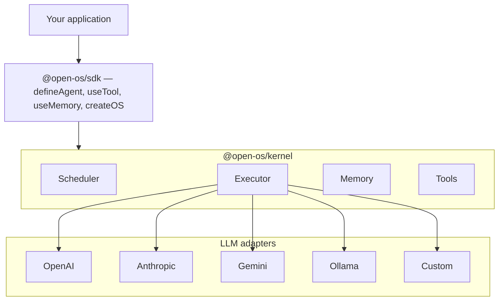

<div align="center">

```
 ██████╗ ██████╗ ███████╗███╗   ██╗ ██████╗ ███████╗
██╔═══██╗██╔══██╗██╔════╝████╗  ██║██╔═══██╗██╔════╝
██║   ██║██████╔╝█████╗  ██╔██╗ ██║██║   ██║███████╗
██║   ██║██╔═══╝ ██╔══╝  ██║╚██╗██║██║   ██║╚════██║
╚██████╔╝██║     ███████╗██║ ╚████║╚██████╔╝███████║
 ╚═════╝ ╚═╝     ╚══════╝╚═╝  ╚═══╝ ╚═════╝ ╚══════╝
```

**The operating system for autonomous agents.**

[](https://opensource.org/licenses/MIT)
[](https://typescriptlang.org)
[](https://pnpm.io)
[](https://discord.gg/openos)

</div>

---

## The idea in one sentence

> Linux gave every developer a kernel to build on top of. OpenOS does the same for autonomous agents.

---

## Why this exists

In 2026, building agentic software is like writing operating systems in the 1970s — every team reinvents the same primitives from scratch. Task scheduling, memory management, tool registries, agent lifecycles, inter-agent communication. Nobody should be writing this boilerplate. It should be infrastructure.

The frameworks that exist today are libraries, not runtimes. They tell you how to wire agents together. They don't tell you how to **run, package, and distribute them as a platform**. There's no npm for agents. There's no kernel you can fork. There's no OS-level abstraction that lets you build once and deploy anywhere.

OpenOS fixes that.

---

## What OpenOS is

A **developer SDK and runtime** for building agentic operating systems.

You define agents. You wire them together. OpenOS handles everything underneath:

- **Agent lifecycle management** — start, stop, restart, timeout, retry
- **Task scheduling** — priority queue, concurrency limits, backpressure
- **Memory bus** — ephemeral, persistent, and shared memory across agents
- **Tool registry** — register once, use from any agent in the system
- **LLM adapter layer** — swap providers without touching agent code
- **Agent packaging** — publish agents to the registry, install them like npm packages
- **Protocol interop** — MCP and A2A support, so your agents talk to the rest of the ecosystem

The result: you focus on what your agent *does*. OpenOS handles how it *runs*.

---

## What OpenOS is not

It's not a no-code tool. It's not a hosted service. It's not locked to any LLM provider.

OpenOS is **infrastructure code** — open source, developer-first, composable. You own your agents and your runtime. We give you the kernel.

---

## Monorepo (this repository)

This repo is a **pnpm + Turborepo** workspace. **Phase 1 is complete:** `@open-os/types`, `@open-os/kernel`, `@open-os/sdk`, `@open-os/cli`, and three reference agents under `agents/`. **Phase 2 (ecosystem)** adds Fumadocs-based [`apps/docs`](./apps/docs), registry HTTP API + `openos publish` / `openos install`, React Flow composer export, `@open-os/mcp`, `@open-os/a2a`, and a thin Python registry client in [`packages/open-os-py`](./packages/open-os-py). UI tokens follow [`DESIGN.md`](./DESIGN.md).

```bash
pnpm install
pnpm build
pnpm test
pnpm exec openos list
pnpm exec openos run agents/web-researcher/index.ts "What is OpenOS?"
```

Set provider API keys from [`.env.example`](./.env.example) (for example `ANTHROPIC_API_KEY`). For the registry app, copy `apps/registry/.env.example` to `apps/registry/.env` if you want to override `DATABASE_URL` (otherwise it defaults to `file:…/prisma/registry.db`).

```bash
pnpm --filter @open-os/docs dev      # http://localhost:3000
pnpm --filter @open-os/registry dev  # http://localhost:3001
pnpm --filter @open-os/composer dev  # http://localhost:3002
```

## Quick start (library usage)

When published to npm, install the SDK package:

```bash
npm install @open-os/sdk
```

```typescript
import { createOS, defineAgent, useTool } from '@open-os/sdk'

// Define a tool
const searchTool = useTool({
  name: 'web_search',
  description: 'Search the web and return results',
  parameters: {
    type: 'object',
    properties: { query: { type: 'string' } },
    required: ['query']
  },
  async execute({ query }) {
    // your implementation
    return [{ title: '...', url: '...', snippet: '...' }]
  }
})

// Define an agent
const researcher = defineAgent({
  id: 'researcher',
  name: 'Web Researcher',
  model: {
    provider: 'anthropic',  // or 'openai', 'gemini', 'ollama' — same code
    model: 'claude-sonnet-4-6'
  },
  tools: [searchTool],
  systemPrompt: 'You are a precise research agent. Always cite sources.'
})

// Boot the OS
const os = createOS({ maxConcurrentTasks: 5 })
os.use(researcher)

// Run
const result = await os.run('researcher', 'What are the top trends in agentic AI?')
console.log(result.output)
```

That's it. No graph definitions. No role configuration. No YAML. Just agents and code.

---

## Architecture



### The kernel

The kernel is the core. It manages:

- **Agent registry** — a Map of `AgentDefinition` objects keyed by ID
- **Task scheduler** — a priority min-heap. Each `os.run()` call creates a Task
- **Executor** — runs an agent turn: builds messages, calls the LLM adapter, handles tool calls, loops until done
- **Memory bus** — namespaced stores, either ephemeral (in-process Map) or persistent (pluggable backend)
- **Event emitter** — every state transition emits a typed `KernelEvent` you can subscribe to

### The SDK

Thin ergonomic wrappers over the kernel. `defineAgent` is a typed factory. `useTool` gives you a builder with proper TypeScript generics for params and return types. `createOS` boots a kernel and returns a clean, high-level interface.

### The adapters

Each LLM provider gets one adapter implementing a common `LLMAdapter` interface:

```typescript
interface LLMAdapter {
  complete(messages: ChatMessage[], config: ModelConfig): Promise<LLMResponse>
}
```

Swapping providers is a one-line change in your `ModelConfig`. The rest of your code is untouched.

### The registry

An npm-style package registry for agents. Built in Phase 2.

```bash
openos publish          # publish your agent to the registry
openos install researcher  # install a community agent
```

---

## How we're different

Every competitor in this space is a **framework** — a library you import to wire LLM calls together. OpenOS is a **runtime** — an OS you build on top of.

The distinction matters.

| | Frameworks (LangGraph, CrewAI, AutoGen...) | **OpenOS** |
|---|---|---|
| **Mental model** | "How do I connect these agents?" | "How do I run an agentic system?" |
| **Abstraction level** | Workflow wiring | OS kernel |
| **LLM lock-in** | Varies (often one provider preferred) | Zero — agnostic by design |
| **Agent packaging** | None | Registry — install agents like npm packages |
| **Language support** | Python-first (mostly) | TypeScript first, Python SDK in parallel |
| **Scales from proto to prod** | Migrate when you grow (CrewAI → LangGraph) | Same kernel, prototype to production |
| **Inter-agent protocols** | Framework-specific | MCP + A2A native — talk to any agent ecosystem |
| **What you own** | Your workflow config | Your entire agentic OS |

### On LLM lock-in

OpenAI's Agents SDK locks you to GPT. AutoGen leans Azure. Google ADK leans Gemini. Every time one of these providers changes pricing, terms, or quality, teams with lock-in are stuck.

OpenOS is built on a principle: **the model is a detail, not the foundation**. Your agent code describes *what the agent does*. The `ModelConfig` describes *which model runs it*. You can hot-swap providers with one config change, run different agents on different providers in the same OS, and test cheaply on local models before paying for cloud inference.

### On the missing registry

As of 2026, there is no npm for agents. You can't write `openos install web-researcher` and get a production-ready research agent in 30 seconds. You can't publish an agent you built and have 10,000 developers use it without any infrastructure work on your part.

That's the gap we're filling. The registry is Phase 2, but it's designed into the architecture from day one. Every `AgentDefinition` is a serializable, versionable artifact. The packaging model is part of the spec.

### On the migration trap

The most common pattern in 2026: teams prototype on CrewAI (fast, intuitive), hit production scale, and migrate to LangGraph (more control, better state management). That migration costs weeks and breaks things.

OpenOS eliminates it. The kernel handles both prototypes and production. The SDK is ergonomic enough for a 10-minute hello world. The runtime is robust enough for enterprise workloads. You start and finish on the same foundation.

---

## Repository structure

```
openOS/
├── packages/
│   ├── kernel/          # Core runtime — agent lifecycle, task queue, memory bus
│   ├── sdk/             # Developer-facing TypeScript SDK
│   ├── cli/             # openOS CLI — run, build, publish agents
│   ├── mcp/             # MCP stdio client → OpenOS ToolDefinition
│   ├── a2a/             # A2A Agent Card + JSON-RPC client helpers
│   ├── open-os-py/       # Thin Python registry HTTP client (pip local path)
│   └── types/           # Shared TypeScript interfaces
├── apps/
│   ├── docs/            # Documentation site
│   ├── registry/        # Agent registry — publish and discover agents
│   └── composer/        # Visual flow composer
├── agents/
│   ├── web-researcher/  # Reference: research and summarize topics
│   ├── code-reviewer/   # Reference: review code for quality and security
│   └── file-manager/    # Reference: file system operations with memory
└── ...
```

---

## Roadmap

### Phase 1 — Foundation `[Complete]`
- [x] Monorepo setup (pnpm + Turborepo)
- [x] Kernel: scheduler, executor, memory, tool registry
- [x] TypeScript SDK: `defineAgent`, `useTool`, `useMemory`, `createOS`
- [x] CLI: `run`, `list`, `init`
- [x] LLM adapters: OpenAI, Anthropic, Ollama (Gemini / custom: typed, not implemented yet)
- [x] Reference agents: web-researcher, code-reviewer, file-manager
- [x] Test suite (Vitest: kernel + SDK; mock adapters, no live LLM calls in CI)

### Phase 2 — Ecosystem `[In progress]`
- [x] Python SDK (thin) — [`packages/open-os-py`](./packages/open-os-py) registry client; `pip install ./packages/open-os-py` until PyPI publish
- [x] **Docs** — Next.js 15 + Fumadocs MDX ([`apps/docs`](./apps/docs)); migrated quick start, architecture, registry, MCP/A2A pages
- [x] **Registry** — Prisma + SQLite; `POST`/`GET` APIs, optional `OPENOS_REGISTRY_API_KEYS`; CLI `openos publish` / `openos install` ([`apps/registry`](./apps/registry))
- [x] **Composer** — React Flow + graph JSON + export generated `createOS()` module ([`apps/composer`](./apps/composer))
- [x] MCP protocol support — [`@open-os/mcp`](./packages/mcp) (`loadMcpTools`, re-exported from SDK)
- [x] A2A protocol support — [`@open-os/a2a`](./packages/a2a) (`fetchAgentCard`, `a2aDelegateRun`, `createA2aDelegateTool`, re-exported from SDK)
- [ ] **Open beta** — public registry host, rate limits / abuse policy, prod `OPENOS_REGISTRY_API_KEYS`, Discord + release comms (ops checklist; not gated on further code)

### Phase 3 — Scale
- [ ] Hosted cloud runtime (OpenOS Cloud)
- [ ] Real-time observability dashboard
- [ ] Team workspaces with RBAC
- [ ] Usage analytics and cost tracking
- [ ] Enterprise: SSO, audit logs, SLA

---

## Contributing

OpenOS is open source and we want your agents in the registry.

```bash
git clone https://github.com/yourusername/openOS
cd openOS
pnpm install
pnpm build
pnpm test
```

To build a reference agent:

1. Create `agents/<your-agent>/index.ts`
2. Export a `defineAgent(...)` as default
3. Add a `README.md` with a description, usage example, and required tools
4. Open a PR — we review every agent submission personally

See [CONTRIBUTING.md](./CONTRIBUTING.md) for the full guide.

---

## License

MIT — fork it, sell it, build on it. The kernel will always be open.

---

<div align="center">

**OpenOS** is built by developers who got tired of rewriting the same infrastructure.

If you're building something agentic and want to talk architecture, open an issue or find us on [Discord](https://discord.gg/openos).

</div>